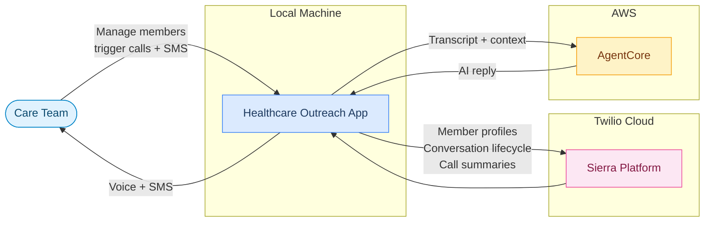

# Healthcare Outreach — System Architecture (Local Dev)

```mermaid
flowchart LR
    careTeam(["Care Team"])

    subgraph local["Local Machine"]
        app["Healthcare Outreach App"]
    end

    subgraph twilio["Twilio Cloud"]
        sierra["Sierra Platform"]
    end

    subgraph aws["AWS"]
        agentcore["AgentCore"]
    end

    careTeam -- "Manage members\ntrigger calls + SMS" --> app
    app -- "Voice + SMS" --> careTeam

    app -- "Member profiles\nConversation lifecycle\nCall summaries" --> sierra
    sierra --> app

    app -- "Transcript + context" --> agentcore
    agentcore -- "AI reply" --> app

    classDef person fill:#e0f2fe,stroke:#0284c7,color:#0c4a6e
    classDef localNode fill:#dbeafe,stroke:#3b82f6,color:#1e3a5f
    classDef twilioNode fill:#fce7f3,stroke:#ec4899,color:#831843
    classDef awsNode fill:#fef3c7,stroke:#f59e0b,color:#78350f

    class careTeam person
    class app localNode
    class sierra twilioNode
    class agentcore awsNode
```
