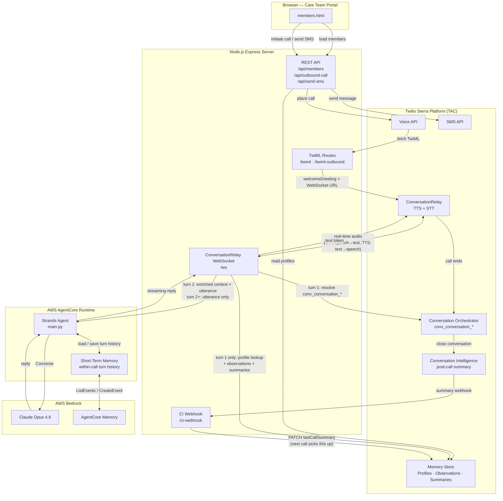

# Detailed Flow: TAC Context Collection → AgentCore Agent

Step-by-step walkthrough of how Twilio Sierra (TAC) collects context and passes it to the AgentCore Runtime agent on every voice call turn.

---

## Architecture



---

## Step-by-Step Flow

### Phase 1 — Before the call (dashboard)

**Step 1 — Care team clicks "Call Maria"**

```
POST /api/outbound-call
{ name: "Maria", phone: "+1408...", goal: "PCP_PREP", goalDesc: "Prepare for PCP visit" }
```

**Step 2 — Node.js stores call context in memory**

```
lastOutboundContext = { name, goal, goalDesc, phone, greeting }
```

The greeting text (`"Hi Maria, this is Owl Health..."`) is built here and stashed — it will be injected into the agent later.

**Step 3 — Twilio places the call**

```
Twilio.calls.create(to, from, url=/twiml-outbound?member=Maria&goal=PCP_PREP&desc=...)
```

---

### Phase 2 — Call connects (TwiML → ConversationRelay)

**Step 4 — Twilio fetches TwiML**

`POST /twiml-outbound` returns:
```xml
<ConversationRelay url="wss://.../ws" welcomeGreeting="Hi Maria..."/>
```
Twilio speaks the greeting via TTS to Maria before the WebSocket opens.

**Step 5 — Conversation Orchestrator creates a Sierra conversation**

Because the outbound capture rule (`from=+18886...`, `to=*`) is configured, Sierra automatically creates `conv_conversation_*` and associates it with the call. This is what enables Conversation Intelligence to write the post-call summary back to TAC Memory.

**Step 6 — ConversationRelay opens the WebSocket**

`setup` event: `{ callSid: "CA...", from: "+1408..." }`
Node.js captures `callSid` and `fromNumber`.

---

### Phase 3 — First member utterance (turn 1)

**Step 7 — Member speaks → Twilio transcribes**

`prompt` event: `{ voicePrompt: "Yes.", last: true }`

**Step 8 — Resolve `conv_conversation_*` from Orchestrator**

```
GET /v2/Conversations?channelId=CA...&status=ACTIVE&configurationId=conv_configuration_*
→ conv_conversation_01kph...
```

Retried up to 5 times with 1s delay because Sierra may not have created the conversation yet when the first prompt arrives.

**Step 9 — Build system prompt and cache call context**

```
systemPromptCache.set(convId, buildSystemPrompt("Maria", "PCP_PREP", "Prepare for PCP visit"))
greetingCache.set(convId, "Hi Maria, this is Owl Health Care Team...")
outboundConversationMap.set(convId, "+1408...")   ← for CI webhook routing later
```

---

### Phase 4 — TAC Memory lookup (turn 1 only)

**Step 10 — Look up the member's profile ID**

```
POST https://memory.twilio.com/v1/Stores/{mem_store_id}/Profiles/Lookup
{ idType: "phone", value: "+1408..." }
→ profileId: "mem_profile_*"
```

**Step 11 — Fetch long-term memory (parallel)**

```
GET /v1/Stores/{id}/Profiles/{profileId}/Observations
→ ["Member prefers morning calls", "Has diabetes type 2", ...]

GET /v1/Stores/{id}/Profiles/{profileId}/ConversationSummaries
→ ["[voice, Apr 15] Confirmed PCP appointment...", ...]
```

**Step 12 — Format memory context**

```
# Customer Context
## Key Observations
- Member prefers morning calls
- Has diabetes type 2

## Previous Call Summaries
- [voice, Apr 15] Confirmed PCP appointment...
```

**Step 13 — Build enriched context**

```
[Greeting already spoken to member]
Hi Maria, this is the Owl Health Care Team calling. I'm reaching out regarding...

# Customer Context
## Key Observations
...
```

The greeting is prepended so the agent knows it already introduced itself and does not repeat it.

> **Turn 2+ — cache hit**: Node.js skips Steps 10–13. The enriched context was saved into AgentCore STM on turn 1 (Step 18), so the agent loads it from STM history instead. No Memory Store API calls are made after the first turn.

---

### Phase 5 — Call AgentCore Runtime

**Step 14 — Invoke AgentCore Runtime**

```typescript
InvokeAgentRuntimeCommand({
  agentRuntimeArn: "arn:aws:bedrock-agentcore:...",
  runtimeSessionId: "conv_conversation_01kph...",   // Sierra convId = session key
  payload: {
    prompt:  "Yes.",                                 // member's words
    context: "[Greeting already spoken...]\n..."     // TAC long-term memory + greeting
  }
})
```

**Step 15 — AgentCore Runtime loads short-term memory**

```python
MemorySessionManager.get_last_k_turns(
  actor_id="agent",
  session_id="conv_conversation_01kph..."   # same key as runtimeSessionId
)
# turn 1 → [] (empty — this is the first turn)
# turn 2 → [{ role: user, "Yes." }, { role: assistant, "Great, thanks Maria!..." }]
```

**Step 16 — Strands Agent processes the turn**

```
input_text = "[Context]\n<enrichedContext>\n\n[User]\nYes."
```

Bedrock receives:
- **System prompt** → "You are Owl Health agent. Member already greeted..."
- **Prior turns** (turn 2+) → conversation history from AgentCore STM
- **Current message** → TAC long-term context + user utterance

**Step 17 — Reply streams back**

```
main.py yields chunks
  → Node.js collects SSE
  → socket.send({ type:'text', token:reply, last:true })
  → Twilio TTS speaks reply to Maria
```

**Step 18 — AgentCore Runtime saves this turn to STM**

```python
MemorySessionManager.add_turns(
  session_id="conv_conversation_01kph...",
  messages=[
    ConversationalMessage(text="[Context]\n[Greeting...]\n# Customer Context\n...\n\n[User]\nYes.", role=USER),
    ConversationalMessage(text="Great, thanks Maria!...", role=ASSISTANT)
  ]
)
# Available on turn 2
# The full enriched input_text is stored (not just the raw utterance),
# so turn 2+ loads the TAC context from STM — no Memory API fetch needed.
```

---

### Phase 6 — Call ends (post-call)

**Step 19 — Maria hangs up**

```
POST /conversation-relay-callback { Status: completed }
→ PUT /v2/Conversations/conv_conversation_01kph... { status: CLOSED }
```

Closing the conversation signals Sierra to run Conversation Intelligence on the recording.

**Step 20 — Conversation Intelligence processes the recording**

```
POST /ci-webhook
{ operatorResults: [{ result: { payload: '{"summary":"..."}' } }] }
```

**Step 21 — Node.js writes summary back to TAC Memory**

```
outboundConversationMap.get("conv_conversation_01kph...") → "+1408..."
POST /Profiles/Lookup → profileId
PATCH /Profiles/{profileId}
  { traits: { outreach: { lastCallSummary: "[voice, Apr 18] ..." } } }
```

On Maria's **next** call this summary is fetched in Step 11 and injected into the agent's context. The loop is complete.

---

## Memory Layers

| Layer | Provider | Scope | Used for |
|---|---|---|---|
| Long-term | TAC Memory Store | Across calls | Member profile, past summaries, observations — fetched once on turn 1 |
| Short-term | AgentCore STM | Within a single call | Turn history including enriched context; eliminates repeat TAC fetches |

## TAC Component Roles

| TAC Component | Steps | What it provides |
|---|---|---|
| **Conversation Orchestrator** | 5, 8 | Links `callSid` → `conv_conversation_*`; enables CI |
| **Memory Store — Profiles** | 10 | Resolves phone number → `profileId` |
| **Memory Store — Observations** | 11 | Long-term facts about the member |
| **Memory Store — Summaries** | 11 | Past call summaries |
| **Conversation Intelligence** | 20, 21 | Auto-generates post-call summary, written back to Memory Store |
| **ConversationRelay** | 6, 7, 17 | Real-time STT (speech → text) and TTS (text → speech) |
